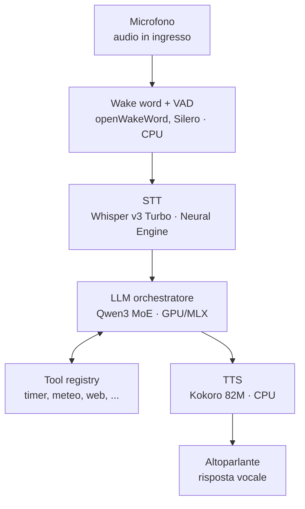
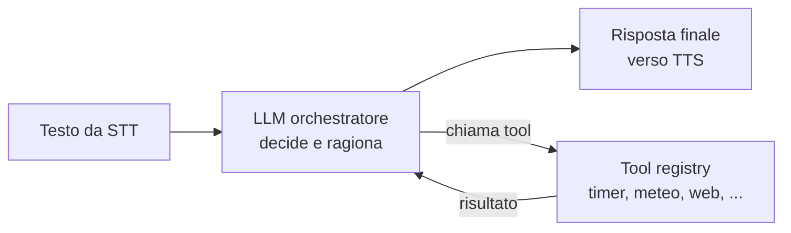

# Assistente vocale locale — Specifica di progetto

> Documento di design destinato a essere usato come contesto per **Claude Code** in fase di
> scrittura del codice. Definisce architettura, contratti tra moduli e requisiti in modo preciso;
> lascia volutamente aperte alcune scelte di basso livello, marcate con **`[SCELTA APERTA]`**,
> da decidere al momento dell'implementazione.

---

## 1. Obiettivo

Costruire un assistente vocale **100% locale** sul core di calcolo (STT + LLM + TTS), in stile
"Alexa ma più potente", che:

- ascolti una *wake word*, trascriva la richiesta, ragioni con un LLM e risponda a voce;
- gestisca conversazione e Q&A generici;
- esegua azioni tramite **tool** (timer, meteo, ricerca web) con un'architettura **estensibile**:
  aggiungere un tool nuovo deve significare scrivere una funzione e registrarla, non riscrivere il sistema;
- sia **local-first**: STT, LLM e TTS non lasciano mai la macchina; solo alcuni tool fanno
  chiamate di rete, e solo quando il modello decide di usarli.

L'utente è madrelingua **italiano**: la lingua principale di interazione è l'italiano.

---

## 2. Hardware e ambiente

| Voce | Valore |
|------|--------|
| Macchina | MacBook Pro, Apple **M5 Pro**, **48 GB** RAM unificata, ~307 GB/s di banda |
| OS | macOS (recente, con supporto Core ML / Metal / MLX) |
| Unità di calcolo | CPU, GPU, Neural Engine — da sfruttare **in parallelo** |
| Lingua | Italiano (principale) |

Principio architetturale guida: **distribuire gli stadi sulle tre unità di calcolo** così che non
competano per le risorse — STT sul Neural Engine, LLM sulla GPU, wake word / VAD / TTS sulla CPU.

---

## 3. Architettura

### 3.1 Pipeline runtime (dal microfono all'altoparlante)



### 3.2 Loop di tool calling (il "cervello")

La parte con i tool **non è lineare**: è un loop agentico. L'LLM riceve la richiesta insieme alla
lista dei tool disponibili (ognuno con schema JSON), decide se rispondere o chiamare un tool,
riceve il risultato e continua, eventualmente chiamando altri tool, finché non produce la
risposta finale.



---

## 4. Stack dei componenti (scelte bloccate)

| Stadio | Tecnologia | Unità | Note |
|--------|-----------|-------|------|
| Wake word | **openWakeWord** | CPU | wake word addestrabile/custom; sempre in ascolto |
| VAD / endpointing | **Silero VAD** | CPU | rileva fine-frase per chiudere la cattura |
| STT | **Whisper Large v3 Turbo** via WhisperKit (Core ML) | Neural Engine | maturo, multilingua, ottimo italiano; tiene la GPU libera |
| LLM | **Qwen 3.6 35B-A3B** (MoE) @ 4-bit | GPU (MLX) | ~3B parametri attivi → veloce; leader multilingua; tool calling nativo |
| Runtime LLM | **Ollama 0.19+** (usa MLX) per partire → **MLX-LM** diretto per il controllo fine | GPU | |
| TTS | **Kokoro-82M** | CPU | italiano, basso lag, footprint trascurabile, Apache 2.0 |

Verifica al momento dell'install: il tag esatto del modello Qwen MoE (i nomi cambiano spesso; c'è
stato un bug noto sull'architettura `qwen35moe` con i vision projector — non ci riguarda, ma
controlla la versione di Ollama).

### 4.1 Budget di memoria atteso (48 GB)

| Componente | RAM stimata |
|-----------|-------------|
| Qwen 35B-A3B @ 4-bit + KV cache | ~20–24 GB (GPU) |
| Whisper v3 Turbo | ~1,5 GB (Neural Engine) |
| Kokoro + wake word + VAD | < 0,5 GB (CPU) |
| macOS + app | ~10–12 GB |
| **Totale** | **~33–38 GB → margine sano, niente swap** |

---

## 5. Requisiti

### 5.1 Funzionali (FR)

- **FR1** — Ascolto continuo della wake word; attivazione alla rilevazione.
- **FR2** — Cattura dell'utterance con endpointing automatico (silenzio → fine frase).
- **FR3** — Trascrizione locale in italiano.
- **FR4** — Risposta conversazionale dell'LLM con system prompt configurabile (persona, lingua, stile).
- **FR5** — Tool calling: timer, meteo, ricerca web. Il modello sceglie autonomamente se/quali usare.
- **FR6** — Estensibilità: nuovo tool = funzione + voce di registry, senza toccare l'orchestratore.
- **FR7** — Sintesi vocale locale della risposta.
- **FR8** — Risposta in **streaming**: la voce parte sulla prima frase completa mentre l'LLM continua.

### 5.2 Non funzionali (NFR)

- **NFR1 — Latenza**: ≤ ~1–2 s al primo audio in condizioni normali. Budget per stadio:
  | Stadio | Target |
  |--------|--------|
  | Endpointing (silenzio VAD) | ~300–500 ms (regolabile) |
  | STT (frase breve, Neural Engine) | ~200–400 ms |
  | LLM time-to-first-token (MoE) | ~100–300 ms |
  | TTS, primo audio (Kokoro) | ~100–300 ms |
- **NFR2 — Privacy**: STT/LLM/TTS interamente locali. Solo i tool `meteo` e `web` fanno rete, e
  solo su decisione del modello. Preferire backend di ricerca self-hosted (vedi §7.3).
- **NFR3 — Estensibilità**: contratto dei tool stabile e documentato (§7).
- **NFR4 — Osservabilità**: log strutturato di ogni turno (testo STT, tool chiamati, latenze per stadio).

---

## 6. Specifica dei moduli

Ogni modulo è definito dal suo **contratto** (input/output e responsabilità). La libreria concreta
e i dettagli interni sono `[SCELTA APERTA]` dove indicato.

### 6.1 Audio I/O
- **Responsabilità**: catturare audio dal microfono (stream a 16 kHz mono, formato atteso da
  wake word/STT) e riprodurre l'audio del TTS.
- **Output**: chunk audio verso il rilevatore di wake word; sink per la riproduzione.
- `[SCELTA APERTA]` libreria audio (es. `sounddevice` vs `pyaudio`); dimensione del buffer/chunk.

### 6.2 Wake word + VAD (endpointing)
- **Responsabilità**: rilevare la wake word; dopo l'attivazione, accumulare audio finché il VAD
  non rileva fine-frase.
- **Output**: un buffer audio dell'utterance completa.
- **Config**: soglia di confidenza wake word; durata di silenzio per chiudere; timeout massimo.
- `[SCELTA APERTA]` wake word specifica (default openWakeWord pre-addestrata vs custom);
  parametri esatti del Silero VAD.

### 6.3 STT
- **Contratto**: `transcribe(audio_buffer) -> str` (sincrono è accettabile per frasi brevi).
- **Responsabilità**: trascrivere in italiano via Whisper v3 Turbo sul Neural Engine (WhisperKit/Core ML).
- `[SCELTA APERTA]` binding concreto (WhisperKit via processo/CLI, `whisper.cpp` con Core ML,
  o wrapper Python); se forzare la lingua `it` o lasciare auto-detect.

### 6.4 LLM
- **Contratto** (streaming + tool calling):
  ```
  stream_chat(messages: list[Message], tools: list[ToolSchema]) -> Iterator[Delta]
  ```
  dove `Delta` è o un frammento di testo, o una richiesta di tool call strutturata.
- **Responsabilità**: incapsulare il backend (Ollama o MLX-LM) dietro un'interfaccia unica così
  da poter cambiare runtime senza toccare l'orchestratore.
- **Config**: nome modello, system prompt, temperatura, `max_tokens`, finestra di contesto.
- `[SCELTA APERTA]` client Ollama (libreria ufficiale vs HTTP raw vs OpenAI-compatible endpoint);
  formato esatto dei messaggi di tool result; gestione del prompt caching.

### 6.5 TTS
- **Contratto**: `synthesize(text: str) -> audio` con supporto a sintesi **per frase**.
- **Responsabilità**: sintetizzare in italiano con Kokoro-82M e passare l'audio all'I/O.
- **Config**: voce/locale, velocità.
- `[SCELTA APERTA]` binding Kokoro (pacchetto Python vs server locale); se generare per frase o
  per clausola; coda di riproduzione.

### 6.6 Tool registry + contratto dei tool *(nucleo dell'este	nsibilità — vedi §7)*

### 6.7 Orchestratore
- **Responsabilità**: cucire tutto. Mantiene la macchina a stati del turno e implementa il loop
  agentico + lo streaming LLM→TTS.
- **Stati**: `IDLE → LISTENING (wake word) → CAPTURING (VAD) → TRANSCRIBING → THINKING (loop tool)
  → SPEAKING → IDLE`. Entrando in `THINKING` parte l'earcon di processing (§6.8), che si
  spegne all'ingresso in `SPEAKING` (primo audio del TTS).
- `[SCELTA APERTA]` modello di concorrenza (`asyncio` vs thread); gestione barge-in
  (interruzione mentre parla) — può essere rimandata a una fase successiva.

### 6.8 Earcon di processing (latenza percepita)
- **Responsabilità**: durante lo stato `THINKING` riprodurre **in loop** un suono breve
  (es. tastiera) per mascherare la latenza dell'LLM con *thinking* attivo; spegnerlo
  nell'istante in cui inizia la voce del TTS. La latenza reale non cambia, migliora la
  **percezione** (cfr. NFR1).
- **Contratto**: `start()` / `stop()` non bloccanti e idempotenti; degrada a no-op se il
  file non è disponibile (non deve mai rompere il turno).
- **Config**: abilitazione, percorso del file, volume (`[audio_feedback]`).
- **Note**: stream di uscita **separato** dalla coda del TTS (§6.5), così i due non si
  calpestano. Implementazione: `src/jarvis/audio_feedback.py`.

---

## 7. Tool: contratto ed estensibilità

### 7.1 Contratto di un tool

Ogni tool è composto da:
1. una **funzione** eseguibile, con firma chiara e tipi espliciti;
2. uno **schema JSON** (nome, descrizione, parametri) che l'LLM riceve per decidere quando usarlo.

Forma concettuale (firma indicativa, non vincolante):
```
Tool = {
  name: str,
  description: str,          # in italiano: guida la scelta del modello
  parameters: JSONSchema,    # parametri tipizzati
  handler: Callable[..., ToolResult]
}
ToolResult = { ok: bool, content: str, error: str | None }
```

Il **registry** è una collezione di tool. L'orchestratore: (a) passa gli schemi all'LLM; (b) quando
arriva una tool call, risolve il nome nel registry ed esegue l'handler; (c) restituisce il
`ToolResult` all'LLM come messaggio. **Aggiungere un tool = aggiungere una funzione + registrarla.**

- `[SCELTA APERTA]` meccanismo di registrazione (decoratore `@tool` vs registrazione esplicita vs
  discovery automatica); validazione dei parametri (es. `pydantic`).

### 7.2 Tool inclusi

| Tool | Tipo | Rete | Note |
|------|------|------|------|
| `timer` | locale | no | crea/lista/cancella timer; alla scadenza emette un suono/notifica |
| `meteo` | API esterna | sì | **Open-Meteo** (gratuito, senza API key; invia solo coordinate) |
| `web_search` | backend di ricerca | sì | vedi §7.3; l'LLM riassume gli snippet |

- `timer`: `[SCELTA APERTA]` persistenza (solo in memoria vs su file per sopravvivere al riavvio);
  meccanismo di notifica (suono via I/O audio vs notifica macOS).
- `meteo`: località di default `[SCELTA APERTA]` (fissa in config vs derivata dalla query).

### 7.3 Ricerca web — bivio privacy

- **Opzione A (comoda)**: API commerciale (es. Brave Search API). Le query vanno a un terzo.
- **Opzione B (coerente con i requisiti di privacy)**: **SearXNG self-hosted** — meta-motore che
  gira in locale; l'LLM riceve gli snippet e li sintetizza.
- **Default consigliato**: Opzione B. `[SCELTA APERTA]` deployment di SearXNG (container locale vs
  istanza già esistente); numero di risultati passati all'LLM.

---

## 8. Flusso di controllo dettagliato (un turno)

1. **IDLE/LISTENING** — l'I/O audio alimenta openWakeWord. Alla rilevazione → CAPTURING.
2. **CAPTURING** — si accumula audio; il Silero VAD chiude alla fine del parlato (o al timeout).
3. **TRANSCRIBING** — STT → testo italiano. Se vuoto/troppo corto → torna a IDLE.
4. **THINKING (loop agentico)**:
   - si aggiunge il messaggio utente alla history; si chiama `stream_chat(messages, tools)`;
   - mentre arrivano i `Delta` di **testo**, si accumulano in un buffer e, **appena si chiude una
     frase**, la si invia al TTS (streaming, NFR1/FR8);
   - se arriva una **tool call**, si esegue l'handler dal registry, si appende il `ToolResult` alla
     history e si **ri-chiama** l'LLM; ripetere finché non termina la risposta;
   - guard-rail: numero massimo di iterazioni di tool per turno (config), per evitare loop infiniti.
5. **SPEAKING** — l'audio in coda viene riprodotto man mano.
6. **IDLE** — log del turno (testo, tool usati, latenze) e ritorno all'ascolto.

- `[SCELTA APERTA]` regola di "fine frase" per lo streaming (regex su `. ! ?` vs segmentatore
  linguistico); gestione delle frasi molto lunghe senza punteggiatura.

---

## 9. Configurazione

Un singolo file di config (`[SCELTA APERTA]` formato: TOML/YAML/`.env`) raccoglie i parametri da
tunare senza toccare il codice:

- modelli: nome/tag LLM, modello Whisper, voce Kokoro;
- runtime LLM: endpoint Ollama/MLX, temperatura, `max_tokens`, contesto, `max_tool_iterations`;
- wake word: parola, soglia di confidenza;
- VAD: durata di silenzio per chiusura, timeout massimo di cattura;
- audio: sample rate, dimensione chunk, device in/out;
- tool: località meteo di default, backend di ricerca + endpoint SearXNG, numero risultati;
- system prompt dell'assistente (persona, lingua = italiano, stile conciso);
- logging: livello, destinazione.

---

## 10. Struttura di progetto suggerita

Indicativa — la disposizione fine è `[SCELTA APERTA]`.

```
voice-assistant/
├── config.{toml|yaml}        # parametri runtime
├── pyproject.toml            # dipendenze
├── README.md
└── src/
    ├── main.py               # entrypoint, avvia l'orchestratore
    ├── orchestrator.py       # macchina a stati + loop agentico + streaming
    ├── audio_io.py           # cattura/riproduzione
    ├── audio_feedback.py     # earcon di processing (loop durante il THINKING)
    ├── wake_word.py          # openWakeWord + Silero VAD
    ├── stt.py                # Whisper v3 Turbo (Neural Engine)
    ├── llm.py                # backend astratto (Ollama/MLX), stream_chat
    ├── tts.py                # Kokoro, sintesi per frase
    └── tools/
        ├── registry.py       # registrazione + risoluzione + esecuzione
        ├── timer.py
        ├── weather.py        # Open-Meteo
        └── web_search.py     # SearXNG (default) / Brave (opzione)
```

---

## 11. Ordine di costruzione (milestone)

1. **MVP push-to-talk, senza tool**: hotkey → Whisper → Qwen3 (Ollama) → Kokoro. Verifica qualità
   e latenza del giro completo.
2. **Streaming LLM→TTS**: spezzatura per frasi, TTS sulla prima. È il salto percettivo più grande.
3. **Tool registry + i tre tool**: timer, Open-Meteo, SearXNG. Nasce qui l'estensibilità.
4. **Wake word always-on** (topologia 1, §12): listener come servizio `launchd` + `caffeinate`.
5. **Opzionale**: passaggio a MLX-LM diretto per le prestazioni; barge-in; satellite Pi (topologia 2).

Ogni milestone deve restare eseguibile end-to-end.

---

## 12. Topologia always-on

- **Topologia 1 — tutto sul Mac, coperchio aperto**: listener wake word come servizio `launchd`,
  `caffeinate` per impedire il sonno. Funziona ma il laptop resta aperto e alimentato (assistente
  "da scrivania"). **Punto di partenza consigliato.**
- **Topologia 2 — Mac come server + satellite sempre acceso**: il Mac espone LLM/STT/TTS sulla LAN;
  un Raspberry Pi (o vecchio telefono) con microfono/altoparlante fa solo wake word + I/O e parla
  col Mac via rete. È la vera topologia "sostituto di Alexa". Il codice dell'orchestratore non
  cambia: cambia solo *dove* gira il microfono.

`[SCELTA APERTA]` protocollo client↔server per la topologia 2 (HTTP/WebSocket); rimandabile.

---

## 13. Testing (note)

- **Unit**: registry dei tool (registrazione, risoluzione, gestione errori handler); spezzatura
  frasi dello streaming; parsing delle tool call.
- **Integrazione**: turno completo con LLM "mock" che emette una tool call nota e verifica che il
  risultato rientri nel loop.
- **Manuale/latenza**: misurazione dei target NFR1 per stadio, loggati per ogni turno.
- `[SCELTA APERTA]` framework di test; strategia di mock per LLM e tool di rete.

---

## 14. Riepilogo delle scelte aperte

Da decidere in fase di codice, senza impatto sull'architettura:

1. Libreria audio e dimensione dei chunk (§6.1).
2. Wake word specifica e parametri Silero VAD (§6.2).
3. Binding concreto di Whisper / forzatura lingua (§6.3).
4. Client LLM e formato dei tool result; prompt caching (§6.4).
5. Binding Kokoro e granularità di sintesi (§6.5).
6. Modello di concorrenza (`asyncio` vs thread) e barge-in (§6.7).
7. Meccanismo di registrazione tool e validazione parametri (§7.1).
8. Persistenza e notifica dei timer; località meteo di default (§7.2).
9. Deployment di SearXNG e numero di risultati (§7.3).
10. Regola di "fine frase" per lo streaming (§8).
11. Formato del file di config (§9).
12. Disposizione fine dei file (§10).
13. Protocollo client↔server per la topologia 2 (§12).
14. Framework di test e strategia di mock (§13).
